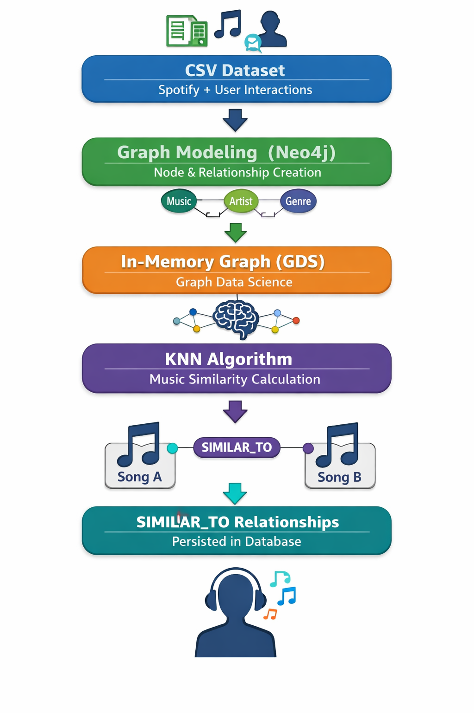
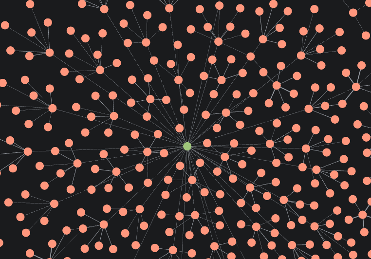

# 🎵 Sistema de Recomendação de Músicas com Grafos e KNN (Neo4j)

📌 Visão Geral

Este projeto implementa um sistema de recomendação de músicas baseado em grafos, utilizando Neo4j e o módulo Graph Data Science (GDS).
A solução combina modelagem de dados em grafos com Machine Learning (KNN) para identificar músicas similares com base em características acústicas e gerar recomendações personalizadas por usuário.

O projeto cobre todo o pipeline:
* Modelagem do grafo
* Ingestão de dados (Spotify)
* Criação de grafo em memória
* Cálculo de similaridade entre músicas
* Validação do modelo
* Recomendação personalizada baseada no histórico do usuário

## 🧠 Problema Resolvido

Como recomendar músicas relevantes para um usuário mesmo sem avaliações explícitas, utilizando apenas:

Características musicais (audio features)

Histórico de escuta do usuário

👉 A solução utiliza Content-Based Filtering, explorando a estrutura de grafos para gerar recomendações escaláveis e interpretáveis.

🏗️ Arquitetura da Solução

<p align="center">
  
</p>


## 🧩 Modelagem do Grafo

<p align="center">
  
</p>


Relacionamentos:

* (Artist)-[:CREATED]->(Music)

* (Music)-[:BELONGS_TO]->(Genre)

* (Music)-[:SIMILAR_TO]->(Music) (criado pelo KNN)

* (User)-[:LISTENED {count}]->(Music)

* (User)-[:LIKED]->(Music)

(User)-[:LIKED]->(Music)


# 🔐 Constraints e Qualidade dos Dados

Foram criadas constraints de unicidade para garantir integridade e performance:

Music.track_id 

Artist.nome_artista

Genre.nome_genero

User.id

Isso evita duplicidade de nós e melhora a execução de queries.


# 📥 Ingestão de Dados
Fonte de Dados:
#### 1- Dataset público inspirado em dados do Spotify link da fonte: "https://www.kaggle.com/datasets/amitanshjoshi/spotify-1million-tracks"
#### 2 - Dataset de usúario que ouviu as músicas nesse caso foi criado eventos artificiais pelo ChatGPT fonte está pasta dataset/user_music_interactions.csv

Carregados via LOAD CSV e Processamento em batch.


#🧠 Machine Learning com Grafos (KNN)
Criação do Grafo em Memória

Um grafo temporário é criado no Graph Data Science contendo apenas nós Music e suas features numéricas:
```
CALL gds.graph.project(
  'musicGraph',
  'Music',
  '*',
  {
    nodeProperties: ['danceability', 'energy','tempo']
  }
);
```

# Cálculo de Similaridade (KNN)

O algoritmo K-Nearest Neighbors calcula a similaridade entre músicas com base em seus vetores de características.
```
CALL gds.knn.write(
  'musicGraph',
  {
    nodeProperties: ['danceability', 'energy', 'tempo'],
    topK: 5,
    similarityCutoff: 0.85,
    writeRelationshipType: 'SIMILAR_TO',
    writeProperty: 'score'
  }
);

```
📌 Resultado: Cada música é conectada às 5 mais similares; Apenas relações com similaridade ≥ 0.85; Score de similaridade gravado na relação


# 👤 Recomendação Personalizada por Usuário

Com base no histórico de escuta do usuário, o sistema recomenda músicas similares às já ouvidas.
```
`MATCH (u:User {id:'user_0001'})-[:LISTENED]->(m1)-[s:SIMILAR_TO]->(m2)
RETURN m2.name, s.score
ORDER BY s.score DESC
LIMIT 10;` 
```

<p align="center">
  
</p>


##
👨‍💻 Autor

Victor Mesquita Xavier
Engenheiro | Analista de Dados | Data Product | Machine Learning
Especialista em soluções baseadas em dados, grafos e produtos analíticos.


